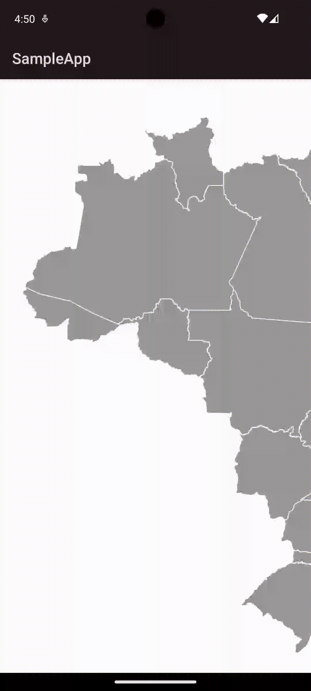

[](http://kotlinlang.org)
[](https://docs.flutter.dev/)

[](https://github.com/CodandoTV/jujubaSVG/issues)
[](https://central.sonatype.com/artifact/io.github.codandotv/jujubaSVG)
[](https://pub.dev/packages/jujuba_svg)


# Welcome to the JujubaSVG library

Welcome to the jujubaSVG library! A CodandoTV library 👋

jujubaSVG is a user-friendly library for handling SVG files in Android and Flutter applications. It enables granular manipulation of SVG elements - you can access any element by its ID to modify properties like background color, stroke, and other attributes.


📚 Our documentation is available [here](https://codandotv.github.io/jujubaSVG/).

---


## How to use? 🤔

### Android

You need to add the following line in your desired `module/build.gradle.kts`:

```kotlin
// ...
dependencies {
    implementation("io.github.codandotv:jujubaSVG:<library version>")
    // ...
}
    // ...
```

After that, you need to define at the top level of your composable function the
`commander` (a friend that will help you to send commands to the library):

```kotlin
@Composable
fun YourComposable() {
    val jujubaCommander = rememberJujubaCommander()
    // ...
}
```

Now you need to declare the Widget responsible to render the SVG file:

```kotlin
@Composable
fun YourComposable() {
    val jujubaCommander = rememberJujubaCommander()

    JujubaSVG(
        svgText = svgText,
        onElementClick = { nodeInfo ->
            println("NodeInfo $nodeInfo")
            coroutineScope.launch {
                // commander sample
                jujubaCommander.execute(
                    Command.RemoveNode(
                        nodeInfo.id
                    )
                )
            }
        },
        commander = jujubaCommander,
    )
}
```

Don't forget:

- `svgText` should contain all content of your SVG file.

### Flutter

You need to add jujuba_svg library in your `pubspec.yaml`:

```yaml
dependencies:
  jujuba_svg: ^1.0.0
```

Let's say you want to use the library in your `my_beatiful_screen.dart`. You need to initialize the controller:

```dart
class MyBeautifulScreen extends StatelessWidget {
  final JujubaCommander commander = JujubaCommander();

  //...

  @override
  Widget build(BuildContext context) {
    return Scaffold(
        body: JujubaSVGWidget(
            commander: commander,
            svgText: svgText,
            onElementClick: (nodeInfo) => {},
        ),
    )
//...
```

The library provides a widget called `JujubaSVGWidget`, there you can the `commander`, `svgText`, and `onElementClick`.

- `commander`: allow you to send commands to manipulate the SVG;

- `svgText`: your SVG;

- `onElementClick`: callback to intercept click events in your SVG.

## Sample project

### Android

More details you can check at our [sample project](android/sampleApp)



### Flutter

- Android


- iOS


--- 

### How to contribute?

- Fork this repository;

- Solve an issue, or do any improvement you want;

- Open a PR to the origin repository.

As soon the PR is reviewed and merged, your update will be available.
