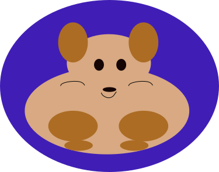

# Welcome to the JujubaSVG documentation! 👋

jujubaSVG is a user-friendly library for handling SVG files in Android and Flutter applications. It enables granular manipulation of SVG elements - you can access any element by its ID to modify properties like background color, stroke, and other attributes.

Take a look at our [repository](https://github.com/CodandoTV/jujubaSVG).

## Summary

### 1. [Getting started](./1-getting-started.md)

### 2. [Available commands](./2-available-commands.md)

### 3. [Contributions](./3-contributions.md)
