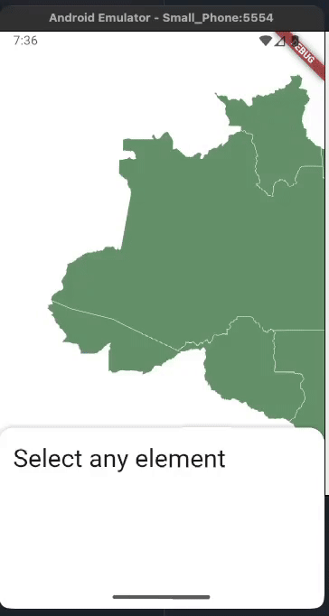
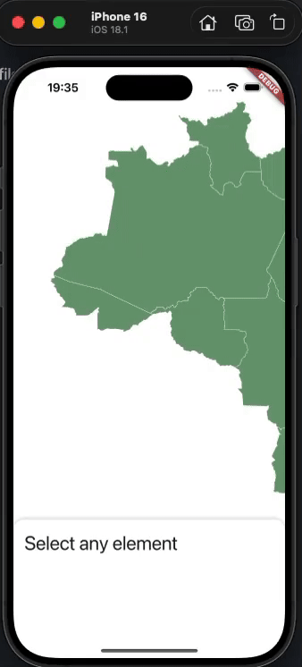

# Welcome to the JujubaSVG library 👋

Welcome to the JujubaSVG library!

JujubaSVG library is a friendly library to handle SVG files in your Flutter app. The library allows you to manipulate piece by piece of your SVG. If you have an id for the element, you can access it to change background, stroke, and other things.

## How to install?

- Coming soon

## How to use?

Let's say you want to use the library in your `my_beatiful_screen.dart`. You need to 
initialize the controller:

```dart
class MyBeautifulScreen extends StatelessWidget {
  final JujubaCommander commander = JujubaCommander();

  //...

  @override
  Widget build(BuildContext context) {
    return Scaffold(
        body: JujubaSVGWidget(
            commander: commander,
            svgText: svgText,
            onElementClick: (nodeInfo) => {},
        ),
    )
//...
```

The library provides a widget called `JujubaSVGWidget`, there you can the `commander`, `svgText`, and `onElementClick`.

- `commander`: allow you to send commands to manipulate the SVG;

- `svgText`: your SVG;

- `onElementClick`: callback to intercept click events in your SVG.

### Sample project

More details you can check in our [sample project](sample).

#### Android



#### iOS



### How to contribute?

- Fork this repository;

- Solve an issue, or do any improvement you want;

- Open a PR to the origin repository.

As soon the PR is reviewed and merged, your update will be available.


